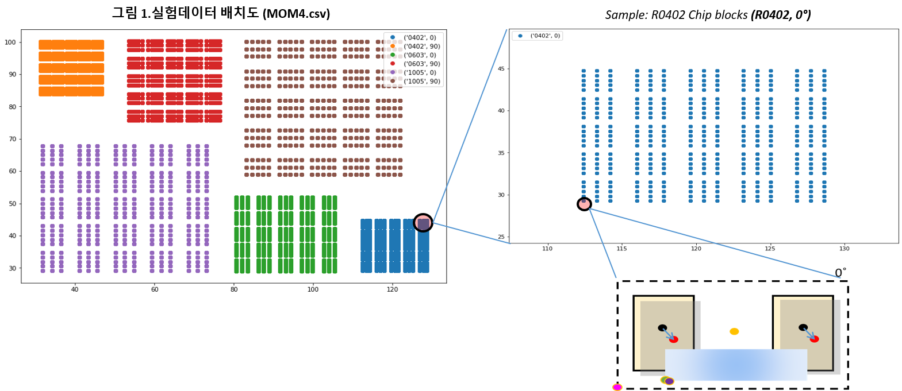
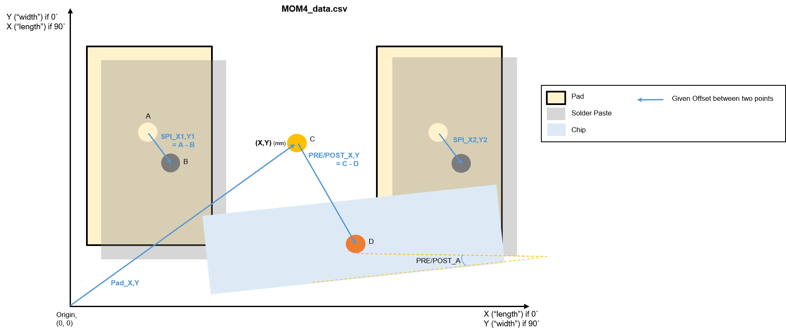
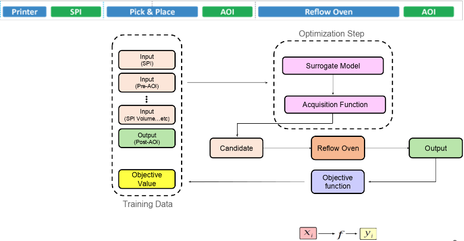
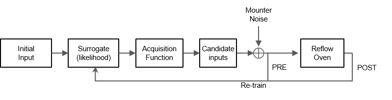

# 고영최적화 과제
- Mounter Feedforward Model: Self-Alignment 최적화 과제

### Data definition



### Optimization pipeline
<!--  -->


## Bayesian Optimization
#### Surrogate Model
- BoTorch (GPyTorch)-based Bayesian Optimization GPR surrogate model
- Neural Process surrogate model

#### Acquisition Function
- UpperConfidenceBound
- Expected Improvement
- q-EI

## Procedure
1. *imputation.py* handles imputation for three missing rows
2. *multirf.py* prepares models for reflow oven simulation (under *reflow_oven*)
3. *main.py* runs the process // modify config.yml for parameters
(or, just run `make` in a shell)
4. *config.yml" contains configuration parameters
5. */ckpts* contains checkpoints for training SingleTaskGP model

> ```python
> python main.py        # run with MOM4 data
> python main.py --toy  # run GP model with toy data
> python main.py --toy --model [anp|np] --load PATH/TO/CKPT_PT
> ```

<!-- ## Contribution
## License -->